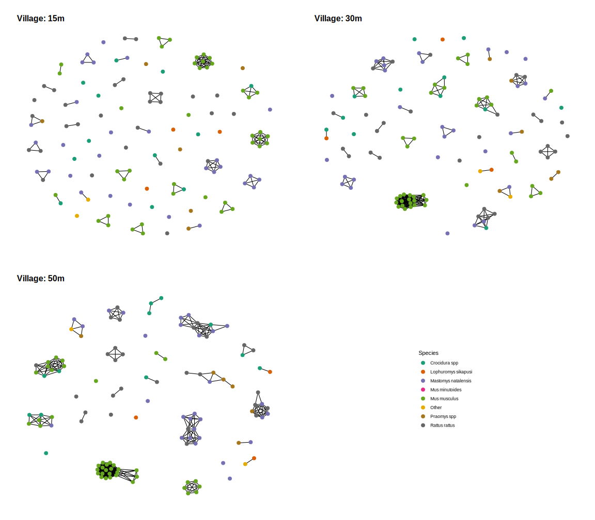
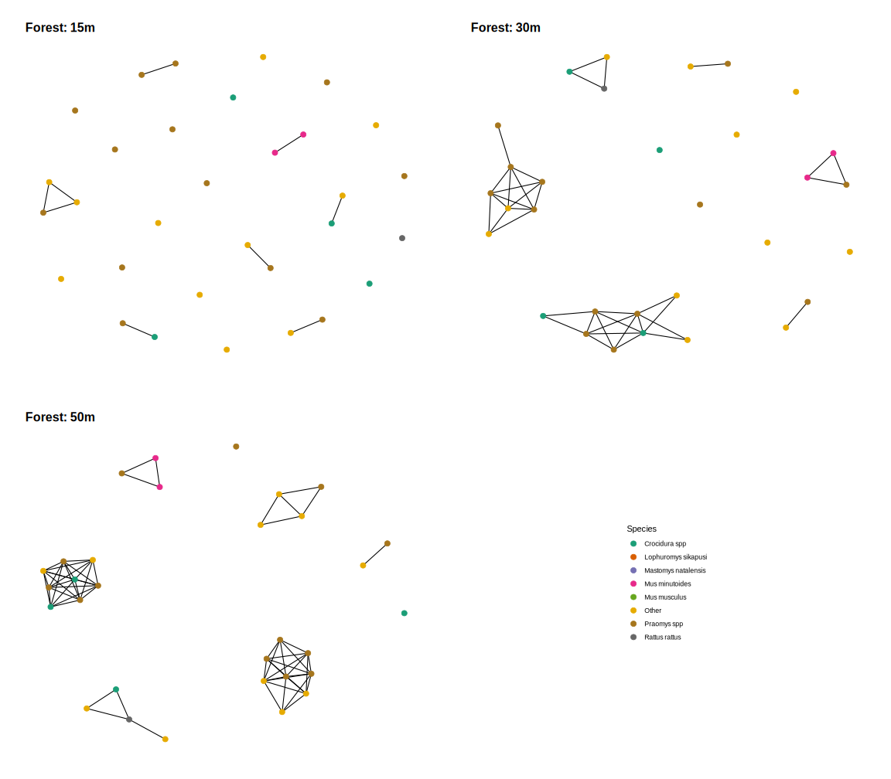
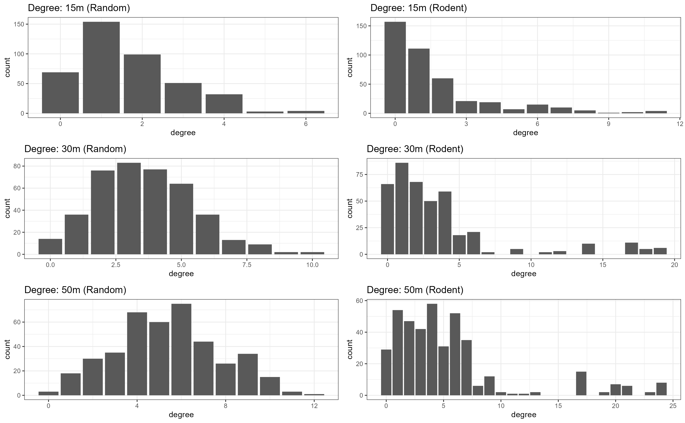
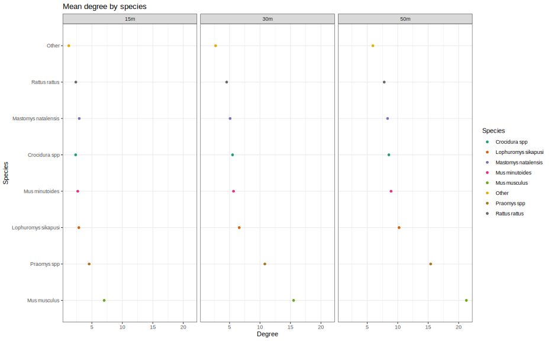

```{r setup, include=FALSE, quietly=TRUE}
knitr::opts_chunk$set(
	echo = FALSE,
	message = FALSE,
	warning = FALSE
)
library(here)
library(readr)
```

# Authorship
David Simons
Ravi Goyal
Umaru Bangura
Ben Rushton
Richard Kock
Deborah Watson-Jones
Kate Jones

I'm unsure what to do with the team from Sierra Leone, they were included as co-authors on the prior chapter which uses much of the same data. Do I include them on this one too? Or because it is a "secondary analysis" of the same data do they not get included?

# Research questions 

This chapter will attempt to address the following questions.

  1. What is the prevalence of antibodies to Lassa fever among rodents in an endemic setting of Sierra Leone?
  2. Does the probability of contact among rodents vary by landuse type?
  3. Does the primary host of Lassa fever have variable inter- and intra-specific contact rates?

# Introduction

Lassa fever caused by *Lassa mammarenavirus* (LASV) is a rodent borne endemic zoonotic disease which is estimated to cause between 100,000-900,000 annual infections across West Africa [@mccormick_prospective_1987; @basinski_bridging_2021]. Asymptomatic infection is common (up to 80%), although individuals who develop severe symptoms requiring hospitalisation have generally poor outcomes with mortality in this group reported as 17% [@mccormick_prospective_1987; @simons_lassa_2022]. The majority of currently reported cases are diagnosed in Nigeria, where the Nigerian Centre for Disease Control (NCDC) have rapidly expanded access to testing and implemented centralised reporting [@agbonlahor_52_2021]. Cases are also sporadically reported from the Mano River Valley countries of Guinea, Liberia and Sierra Leone, where testing is less available [@jetoh_epidemiological_2022; @shaffer_space-time_2021; @bausch_lassa_2001]. Within countries reporting Lassa fever cases there is important spatial clustering, typically from rural areas with previously identified outbreaks [@agbonlahor_52_2021]. A seasonal component to Lassa fever outbreaks has also been observed, NCDC reports cases peaking in the first 3 months of the year, with low numbers of cases reported throughout the remainder of the year [@gomerep_epidemiological_2022]. This seasonal pattern is less pronounced in the Western endemic countries with no consistent seasonal association with peaks in reported cases [@shaffer_space-time_2021; @jetoh_epidemiological_2022].

Human infections are caused by pathogen spillover from rodent hosts, with a limited role of subsequent human-to-human transmission [@lo_iacono_using_2015]. The primary host, *Mastomys natalensis* is a commensal, native, rodent species present throughout sub-Saharan Africa. This species does not develop clinical symptoms following infection with LASV and are susceptible to low infectious doses consistent with what might be obtained from a wound caused by direct contact with an infected conspecific or indirect contact through contaminated environmental exposure [@safronetz_temporal_2022]. Viral RNA is detectable 3 days post infection, peaking within 1 to 2 weeks and resolving within 40 days. RNA persistance was observed in testes beyond this 40 day interval suggesting that prolonged sexual transmission may exist. The dynamics of antibody responses in infected rodents are not currently known. Based on a similar arenavirus (Morogoro virus), seroconversion is expected to occur 7 days post infection, with detectable antibodies remaining beyond the point where circulating RNA has declined [@borremans2015shedding]. A recent study conducted in Sierra Leone reported a prevalence of antibodies among rodents against LASV of 2.8% and a prevalence of LASV acute infection, through PCR, of 0.3% demonstrating the challenges of detecting acute infection [@bangura_lassa_2021].

While *M. natalensis* is considered the primary reservoir, 10 additional rodent species have been identified to be acutely or previously infected with LASV in endemic regions [@simons_rodent_2022]. The contribution of these species to pathogen spillover into human populations, and viral transmission or maintenance among rodent communities is unknown. Direct and indirect contact between rodents in species rich environments may produce incidental infections of non-reservoir species which are subsequently detected through surveillance activities, despite having little impact on viral transmission [@gilbert_deciphering_2013]. Alternatively, these species may act to transfer this pathogen spatially, linking geographically isolated *M. natalensis* populations and maintaining viral populations within the reservoir species [@cardenas_multiple_2022; @caron_bridge_2015]. It is therefore important to characterise rodent networks within endemic settings, expanding investigations to the entire rodent community rather than focussing on a single species' population [@albery_science_2021].

The composition of rodent community networks and potential interactions between rodent species in Lassa fever endemic regions has not been systematically reported. Previous studies have limited description of wider rodent populations to measures of species richness and diversity which only provide evidence of potential contact at a habitat level [@fichetcalvet_diversity_2010; @happi_increased_2022]. Additional information on the temporal and spatial overlap of individuals to infer potential for contact between individuals and importantly the risk of transmission of zoonotic pathogens, including LASV, is important. Pathogens typically persist in dense, well-connected networks when frequency dependent transmission dominates [@begon_transmission_1999]. In discontinuous networks, pathogens with limited environmental transmission will become locally extinct out as the number of susceptible individuals is rapidly depleted [@almberg_parasite_2012-1; @swinton_persistence_1998]. We hypothesise that rodent contact rates, particularly among commensal rodent species would be greater in anthropogenically dominated habitats where nutritional resources are more concentrated than in other landuse types. We further hypothesise that spatial clustering of conspecifics and dominance of commensal species in these settings will lead to greater intra-specific contact rates compared to inter-specific contact rates. It is expected that rodent species with high contact rates will be associated with antibody positivity for LASV.

Here, we report potential contact networks of rodents in a Lassa fever endemic region, we analyse these networks to identify the rate of contact between rodents in different landuse settings. We report the prevalence of antibodies against *Lassa mammarenavirus* among rodents the region and explore the contact networks of positive rodents by land use settings.

# Methods

## Study area

We conducted rodent trapping surveys between October 2020-February 2023 within and around four village study sites (Baiama; latitude = 7.8375, longitude = -11.2683, Lalehun; latitude = 8.1973, longitude = -11.0803, Lambayama; latitude = 7.8505, longitude = -11.1969, and Seilama; latitude = 8.1224, longitude = -11.1936) in the Lassa fever endemic zone of the Eastern Province of Sierra Leone. Surveys were conducted within trapping grids along a landuse gradient of anthropogenic disturbance comprising, forest, agriculture (including fallow and currently in-use areas), and villages (within and outside of permanent structures). Trapping survey sessions within each village occurred four times annually with two trapping surveys in each of the rainy and dry seasons (May to November and December to April, respectively), giving a total of 9 trapping sessions over the study period.

Village study sites and trapping grids within the village study sites were selected to be representative of land use in the Eastern Province of Sierra Leone and based on accessibility to the sites during all seasons and acceptability of the study protocol to the village study site communities. Supplementary Material 1 contains detailed information about the trapping process. Briefly, at each trapping grid 49 Sherman traps (7.62cm x 8.89cm x 22.86cm) (H.B. Sherman Traps, Tallahasee, USA), were placed in a 7 trap by 7 trap grid, traps were placed 10 metres apart in a regular grid conforming to the local landscape (median trapping grid area = 4,813m^2^). For traps placed within permanent structures trap placement varied from this grid structure. Permanent structures were selected semi-randomly at each visit from a grid projected over the village area, with four traps placed within each structure. The location of each individual trap within trapping grids was geolocated for subsequent data processing. Traps were baited with a locally produced mixture of oats, palm oil and dried fish. Each morning the traps were checked and closed for the day prior to re-baiting during the evening. Each trapping survey session consisted of four consecutive trap-nights (TN) at each trapping grid within the village study site.

Trapped rodents were associated with the coordinates of the trap they were detected in. The `sf` package in the R statistical computing language (R version 4.1.2) was used for geospatial manipulation and analysis [@pebesma_simple_2018; @r_core_team_r_2021]. All rodent handling was performed by trained researchers, rodents were sedated with halothane and euthanised prior to obtaining morphological measurements and samples of blood and tissue following published guidance [@fichet-calvet_chapter_2014]. The study protocol was approved by the Clinical Research Ethical Review Board and Animal Welfare Ethical Review Board of the Royal Veterinary College, United Kingdom (URN: 2019 1949-3), and Njala University, Sierra Leone. Carcasses were destroyed through incineration to eliminate the risk of onward pathogen transmission.

## Rodent species identification

Morphological taxonomic identification was performed in the field based on external characteristics using a taxonomic key, including external body measurements and physical characteristics, developed from Kingdon and Monadjem (Supplementary Material 2) [@kingdon_mammals_2013; @monadjem_rodents_2015]. Morphological identification alone is unable to distinguish some small-mammal species within the study area at species level. Therefore, molecular identification was performed on whole blood, tissue or dried blood spots. Samples were stored at -20°C until processing, genomic DNA was extracted using QIAGEN DNAeasy kits as per the manufacturers instructions [@qiagen_dneasy_2023]. DNA extracts were amplified using platinum *Taq* polymerase (Invitrogen) and cytochrome B primers [@bangura_lassa_2021]. DNA amplification was assessed through gel electrophoreisis with successful amplification products undergoing Sanger sequencing. Attribution of obtained sequences to rodent species was through the BLAST programme comparing NCBI species records for rodent cytochrome B to our sample sequences (Supplementary Material 2) [@altschul_basic_1990].

## *Lassa mammarenavirus* serology

The BLACKBOX® LASV IgG ELISA Kit developed by the Diagnostics Development Laboratory hosted at the Bernhard Nocht Institute for Tropical Medicine and validated for rodent samples was used to determine serological status of trapped rodents [@gabriel_development_2018; @soubrier_detection_2022]. The protocol is available as Supplementary Material 1. Briefly, 1 µL of whole blood was inactivated by mixing with the provided sample dilution buffer (1:50). Where whole blood was unavailable, blood was extracted from dried blood spots stored on filter paper by incubating with phosphate-buffered saline containing 0.08% Sodium Azide and 0.05% Tween 20. Samples and negative and positive controls were incubated on the provided ELISA plate for 24 hours at 4-8 °C in a wet chamber. Following incubation, the plates were washed with subsequent incubation for one hour with 1:10,000 diluted HRP-labelled streptavidin. A final wash was performed before the addition of 100 µL of 3,3',5,5'-Tetramethylbenzidine (TMB) substrate to all the wells, with incubation for 10 min. The colorimetric reaction was stopped by adding 100µL of a stop solution.

In a deviation from the kit description the optical density (OD) at 450nm and 630nm was measured (as opposed to 450nm and 620nm). The index value was produced from the OD difference (OD~450~-OD~630~) divided by the cut-off values (the mean values of the negative controls + 0.150). Samples were considered positive with index values greater or equal to 1.1, negative results less than or equal to 0.9, and inconclusive results when the index value lay between 0.9 and 1.1. Inconclusive results were repeated as advised by the kit manufacturers.

## Preparing rodent contact networks

Rodents were considered to have potential direct or indirect contacts with other individuals if they were trapped within a created buffer zone of 30m radius circle (2,828 m^2^). This value was selected to account for the potential home ranges of an individual. No distinction was made between species for defining this buffer. The HomeRange dataset collates information from studies on the home ranges of species, 4 of our expected species are contained in this dataset with data from a further 4 species that share higher taxonomic classification with our detected species [@broekman_homerange_2023]. Using a buffer with a 30m radius contains the entirety of detected home ranges of indiiduals of **M. natalensis** our primary species of interest and greater than 50% of the individuals of **Lemnisomys striatus**, **Mus musculus** and **Rattus rattus** (81%, 92% and 52% respectively) (Supplementary Figure 1.). Sensitivity analyses were performed on the same dataset using buffer areas of 15m and 50m. 

We produced networks for each landuse type at each visit.

Within our trapping grids only a subset of all rodents are detected in traps. Including unobserved individuals, and therefore unobserved contacts between these individuals aids fitting of models to observed data, by providing a measure of expected missingness. To estimate the abundance of individuals of each species we used a N-mixture model to estimate population size from repeated count data implemented in the `unmarked` R package [@royle_n-mixture_2004; @fiske_unmarked_2011]. This approach assumes a closed population. Using this approach the latent abundance distribution can be modelled as a Poisson, negative binomial or zero-inflated Poisson random variable, the AIC of each of these models was compared to select the best fitting model. The mode of the estimated abundance was used to generate the unobserved individuals at each trapping site, within each landuse type for each visit. The number of observed individuals was then subtracted from the estimated population size to derive the number of unobserved individuals of each species. These individuals were explicitly set to have missing contact properties.

## Statistical analysis

### How does landuse-, species- and individual-level heterogeneity influence contact networks?

Over a fixed period of time, a pair of individuals either will or will not experience a contact sufficient to transmit *Lassa mammarenavirus*. We consider a binary network of contact or no-contact between trapped individuals based on a radius of 50m around the location they were trapped, during the same trapping period (4 days). We produce contact matrices for each study site, during each trapping session, within each study village. The location of each trapped individual is associated with a buffer zone with a radius of 50m (0.0079 km^2^), using the `sf` package in the R statistical computing language [@pebesma_simple_2018; @r_core_team_r_2021]. Within a trapping session a contact is defined if a different individual is trapped within this area. We do not use overlapping ranges for both rodents, as it is not possible to ascertain where in an individual rodents range it was detected, as a simplifying assumption we therefore limit the production of a spatial range to the index individual. 

Attributes of an individual rodent are included as nodal attributes and include the species of the individual, the setting of the village study site (rural or urban), the land use of the trapping site, the season in which it was trapped (dry or rainy), the age classification of the rodent and its serostatus. Networks are produced with nodes representing individual rodents and undirected edges representing contacts between individuals using the `igraph` and `network` packages in R [@csardi_igraph_2006; @butts_network_2008].

To investigate whether land use type, season and species type impact the properties of these networks we model these contacts as Exponential-Family Random Graphs (ERGM) [@hunter_ergm_2008]. ERGMs implement maximum likelihood estimates to produce an Odds Ratio for the probability of an edge forming following the addition of a new single node into a network based on network properties and nodal attributes. We use these produced models to compare the probabilities of edges forming based on rodent characteristics and environmental characteristics (i.e. land use type and season). Models are constructed step-wise with terms for node homophily and network characteristics included as supported by reduction in penalised metrics including AIC and BIC. The general model term for the entire network follows Equation 1.

$$
\log({\exp(\theta'g(y))}) = \theta_1g_1(y) + \theta_2g_2(y)+ ... + \theta_pg_p(y)
$$

Here $p$ is the number of terms in the model, the coefficients $\theta$ represent the size and direction of the effects of the covariates $g(y)$ on the overall probability of the network. At the edge level the expression for the probability of the entire graph can be re-expressed as the conditional log-odds of a single edge between two nodes (a contact between two rodents) as in Equation 2. \ref{eq:2}:

$$
\operatorname{logit}{(Y_{ij}=1|y^{c}_{ij})=\theta'\delta(y_{ij})}
$$

Here $Y_{ih}$ is the random variable for the state of the node pair $ij$  and $y^{c}_{i,j}$ signifies all dyads in the network other than $y_{i,j}$. $\theta'$ is the coefficient for the change production of an edge between the two nodes conditional on all other dyads remaining the same ($\delta(y_{ij}$).

Using this approach we can investigate the conditional probability of the selected coefficients of land use, seasonality, rodent species and serostatus on an edge forming between two individuals. We report the probability of edges forming in urban compared to rural settings, in agricultural compared to built-up areas and between members of the same or different species and finally serostatus for *Lassa mammarenavirus*.

Expanded with estimates of abundance to include non-observed individuals (nodes) in the networks. Assumed closed population, used mode. 

# Results 

420 individual rodents were trapped from 26,524 trap-nights (TN). 12 species were identified from molecular classification, the majority of which were identified as *M. natalensis* (N = 75, 17.9%), *Lophuromys sikapusi* (N = 44, 10.5%) and *Mus musculus* (N = 41, 9.8%) (Table 1.).

Antibodies to *Lassa mammarenavirus* were identified in 20 (4.4%) rodents, including 7 *M. natalensis* (35%), 5 *Crocidura spp.* (25%), 3 *L. sikapusi* (15%) and 3 *Mus minutoides* (15%) (Table 1.). The highest proportion of positivity by the number of individuals tested from a species was observed in *Malacomys edwardsii* (N = 1, 12.5%), *M. natalensis* (N = 7, 9.3%) and *Mus minutoides* (N = 3, 8.6%).

Rodents with antibodies to *Lassa mammarenavirus* were detected in three of the villages, Lalehun (N = 11, 55%), Seilama (N = 8, 40%) and Baiama (N = 1, 5%) (Supplementary Table 1.). No positive rodents were detected in Lambayama or Bambawo. Among the villages with positive rodents the highest rates of positivity among trapped rodents was from Lalehun (10.1%), followed by Seilama (4.2%) and Baiama (2.2%). Positive rodents were detected during all study visits, the highest rate of positivity was observed during trapping conducted in June (N = 5, 8.6%), the lowest positivity rate was observed in November (N = 1, 2.2%) (Supplementary Table 2.). Most antibody positive rodents were trapped in agricultural settings (N = 13, 65%), followed by peri-urban (N = 6, 30%) and forest settings (N = 1, 5%). The rate of positivity was similar in both village and agricultural settings (4.9%) and lower in forest habitats (3.2%).

## Rodent contact networks

**I am currently working on this with a colleague, I can share some preliminary results for context. The current approach is treating the data as a single network and is not incorporating any measure of the total population size of which this is a sample. This is not the most appropriate approach and so I am currently working on producing a network for each site trapping instance and there will be an estimate of rodent abundance incorporated into the modelled networks. The figures I present here include the sensitivity analysis of the effect of changing the rodent buffer range. When I change to the multi-network method the Odds Ratio that will be produced for each network will be used to produce a weighted mean probability of a contact forming rather than the current output which is the probability of a contact forming using the whole network.**


Rodent contact networks can be reconstructed from rodent trapping data. Typically capture-mark-recapture (CMR) methods are used to determine space-sharing by individuals [@carslake_spacetime_2005; @clay_contact_2009; @wanelik_new_2022]. Within our system a CMR approach is not deemed appropriate due to the potential risk of releasing an infected rodent back into human communities. We adopt a similar approach to define contacts as Perkins *et al.* 2009, defining a direct or indirect contact as individuals trapped within a defined distance of each other, allowing that each individual can only be trapped once [@perkins_comparison_2009]. Contact networks have been used to model infectious disease transmission using Exponential-Family Random Graph Models (ERGMs) which assume dyadic independence - the probability of observing a particular edge $k$ is independent of other edges, after accounting for node- and edge-level covariates [@wilber_modelling_2019] 

These images show the networks produced by land use type and repeated for each of the proposed rodent range radii, 15m, 30m and 50m.






The mean degree (number of contacts) we observed for individual rodents was 1.7 (s.d. 2.2) using the 15m dataset, 3.6 (s.d. 4.4) using the 30m, and 5.4 (s.d. 5.4) using the 50m data. The density of the networks (the proportion of all possible edges that are observed) follows a similar pattern of .004, .008 and 0.013 respectively.

Using these network properties we can produce random graphs. These can then be compared to the observed graphs to see if what we observe is different from a randomly assorted network. For each of the three datasets we see more isolated individuals and more highly connected individuals than would be expected by chance alone. 



The potential drivers of these patterns is assortative mixing, I will focus on species, land use and village setting as they are questions I am interested in although additional coefficients may be added to the models. An example of this can be shown by looking at the number of contacts we observe by species.



The current model includes terms for the species type, a homophily term for species (are species more likely to have contacts with members of their own species), and homophily terms for season, village location and landuse type. There is an additional term which includes a random effect to account for individuals that do not have a contact with other individuals which provides a slightly better fitting model. Using this model we can predict the probability of a contact for a new rodent of different species in different landuse types. The model produces networks that are more connected than what we observe which is why I am trying the alternate approach described above. Despite this I think the general findings will not change dramatically.

Rodents are around 3 times more likely to have a contact if they are in the village compared to agricultural land use. Rodents in rural compared to urban settings are more likely to have contacts. *Mus musculus* are more likely to have contacts with others of the same species but less likely to have contact with non-*Mus musculus* individuals. *Mastomys natalensis* show a similar pattern. *Praomys* in contrast are more likely to have contacts with other rodents but are relatively equally likely to have contact with other species as with members of their own species. 

## Limitations and assumptions

  1. Rodent ranges and the concept of shared space use. Assuming that a rodent moves some distance X from its nest/home, it would spend a decreasing proportion of time in locations distal to this centre, with more time being sent in the central region. This is likely a simplification of their behaviour but will be used to illustrate the assumptions for contact. We trap this rodent at some point within this range. Whether it is trapped at the centre of its range or periphery is not known based on the observed data. We would need to have multiple captures and releases of a single individual in order to assess its true range. The subsequent buffering around this capture point and saying this is the rodents range is therefore a strong assumption. This is further complicated by including the same assumption for another rodent and saying that these rodents share a range and have a contact, rather than just some probability of a contact (which would be more truthful but difficult to estimate without intensive data on rodent movements). We will use a single assumption of range around a trapping point irrespective of species. This is unlikely to be true but there is no good data I have found on the range of the species we trap in the study sites.

```{r, echo=FALSE, out.width="49%", out.height="49%", fig.show='hold', fig.cap="L) Probability distribution for a rodent range. It is highly unlikely that a rodent will partition its time in space like this. R) A two dimensional representation of probability of contact for two individual rodents"}
knitr::include_graphics(c(here("report", "figures", "3D-gaussian.png"), here("report", "figures", "shared_space.png")))
```

  2. Missingness. We are not observing the entire rodent population that uses a trapping grid. The number of rodents that are trapped is likely a small subset of all those that are active in that space. This may also vary by species, time of the year and location. For example, *Mus musculus* may be more likely to enter a trap than  a *Praomys rostratus* so for the same trapping effort we would detect more *M. musculus*, leading to this species being over-represented in our sample and therefore contact network. Rodents may be more likely to enter a trap in periods of food scarcity, differential probability of detection by season could confound any inference on changing contact networks by season. Finally location is potentially important, a trap in the forest may be more or less likely to be entered than one in a home. Again, given a consistent trapping effort we may therefore observe an increased number of rodents in one of these locations that would result in our contact networks being denser or sparser than what they truly are. There may be a way we can understand these biases differently. First, we can assess the probability of detection using the methods in Chapter 3 across repeated trapping sessions. This could potentially help to understand whether we are more likely to detect a species during different conditions. Unfortunately this is at the species level rather than individual level. Second, we can estimate abundance of individuals in a trapping location. From this we can estimate the number of unobserved individuals and hence, the proportion of the population we are able to model. Any estimate of abundance will be poor and can only be treated as a very crude estimation.
  
  3. Contact. Beyond the probability and shared space approach we are introducing assumptions into contacts by the choice of definition. Lassa is transmitted through both direct and indirect means so contacts to not need to be both spatially and temporally overlapping. We are only observing rodents for 4 day periods so we do not have to worry too much about the temporal overlap. The spatial overlap issue is described above.
  
  4. Single observations. I have not found an article that uses single observations for this approach and the examples I have use Capture-Mark-Release (CMR) approaches. My interpretation of the limitation we have from single observations is that if there were other potential contacts for that individual we miss them if we are not trapping them over multiple observations. However, most studies trap for short periods of time and it is unclear how often they recapture the same individual, particularly for rodent studies. I am not really sure if this means that this approach is invalid.

  5. We did not alter buffer areas by species as. No were these homeranges obtained from studies conducted in West Africa or Sierra Leone. Rodent species may have different home ranges across their distribution.
  
## Mitigations

To mitigate the issues introduced in 1. and 3. I am intending on performing sensitivity analysis, changing the diameter around a trapped rodent at which we allow a contact to form. I would feel more confident in this approach if the probability of a contact between two individuals remains proportional based on the defined range. Any dramatic changes in the probability of a contact, in direction rather than magnitude, could be problematic. Missingness can be introduced into the modelling method if an estimate of abundance is possible. I am unsure how this will impact the probabilities of contacts but again I think sensitivity analysis would be useful to explore for this.

Rodents move around, their expected range is Xm. We set traps covering Ym^2 in different landuse types across 4 villages in Sierra Leone over Z trapping sessions. If a rodent was trapped within 50m of another rodent during the same trapping session we define this as a potential contact, either direct or indirect. We explore these networks of contacts through an ERGM approach to explore the probability of a contact between different species under different land-use conditions. 

----------------------------------------------------------------------